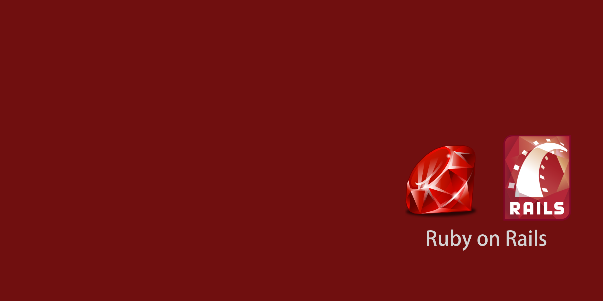
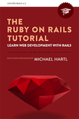
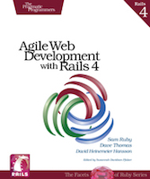
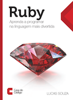
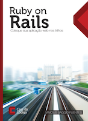

# DAFRAD

A disciplina de Desenvolvimento Ágil com Ferramentas RAD (DAFRAD) do Curso Superior de Tecnologia em Sistemas para Internet do IFPB tem como objetivo apresentar ao aluno conceitos sobre desenvolvimento ágil para Web através do framework Ruby on Rails. Sua carga horária apresenta um total de 50 horas aula e será ministrada pelos professores [Luiz Carlos]() e [Daniel Vilar](). Para as aulas serão utilizadas exposições e atividades práticas, além de avaliações individuais e em grupo.

## Conteúdo

* Introdução ao desenvolvimento ágil
  * Ambientes de desenvolvimento e integração contínua
  * Poder do shell e geração de código
  * Metodologias ágeis
  * Comparativos sobre frameworks ágeis
* Sintaxe do Ruby
  * Introdução e estrutura da linguagem
  * Elementos Básicos
  * Expressões
  * Funções e Blocos
  * Objetos
  * Extensões da linguagem
* Framework Rails
  * Introdução e estrutura do framework
  * Utilitários: irb, rails, rake, bundle
  * Estrutua do MVC
  * Active Record, Migration, Association, Validation
  * Layout, Partial, Helper, Assets Pipeline
  * Controler e Action
  * Rotas e Restful API
  * Requisições AJAX
  * Content Negotiation
  * Filter, Cookie, Session e Autenticação
  * Internacionalização
  * E-mails
  * Testes funcionais e unitários
  * Extensões: Paginação, Slug URL, Admin Dashboard, Breadcrumb e Framework CSS.

## Avaliações

A nota final será computado através da média aritmética das avaliações e poderá ser adicionada com atividades extras.

### Provas Prática
* Avaliação I: Fundamentos de Ruby;

### Trabalho
* Projeto I e II: [A especificação do projeto]().

## Comunicação
Toda a comunicação será realizada usando o 

## Bibliografia

### Bibliografia Básica

 

### Bibliografia Complementar

 
